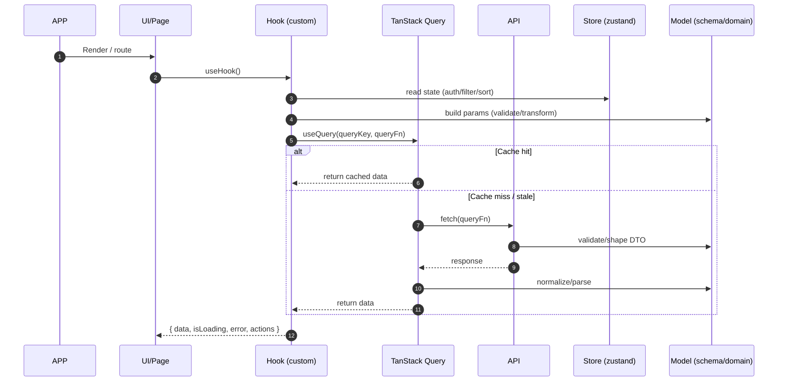

# Bite Web

## Known Issues

- recharts
  - Current: 2.15.4
  - Latest: 3.6.0
  - Issues: https://github.com/shadcn-ui/ui/issues/7669

- react-resizable-panels
  - Current: 3.0.6
  - Latest: 4.3.3
  - Issues: https://github.com/shadcn-ui/ui/issues/9118

## Data Fetching Architecture

